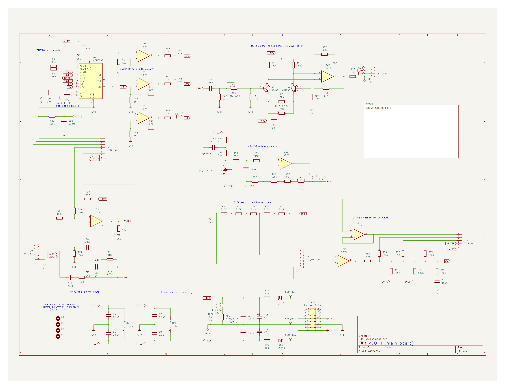
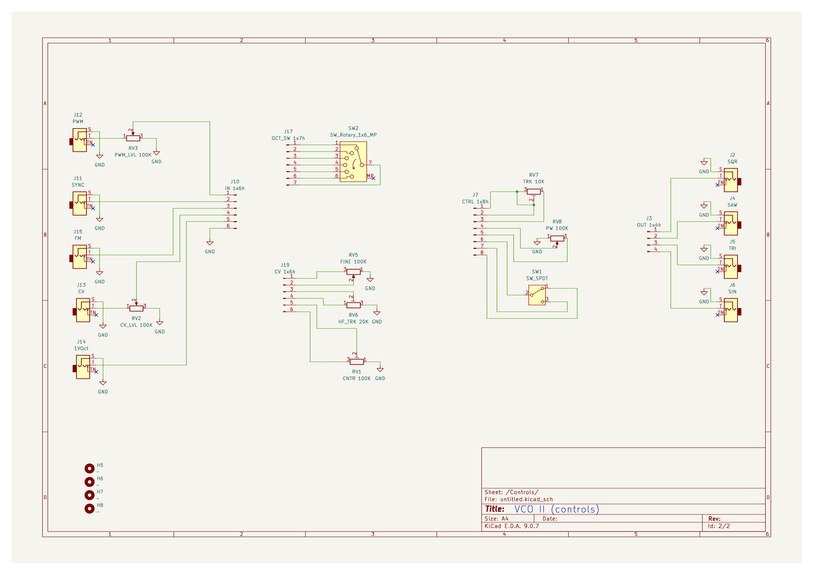

# VCO 2

This VCO based on the work of  LMNC [performance VCO](https://www.lookmumnocomputer.com/1222-performance-vco). I've swapped out the built in tuner for a sine wave generator based on the Henry Thomas design. I also expanded the octave range by one and enabled hard/soft sync selection. Finally I've set the gain on the output Op-Amps so that everything is around 9-10V out. Why drop the tuner? Well, I'm unlikely to go performing and I was thinking I'll just build a single tuning module to take advantage of the control panel trim pots. 

There are a couple of folders included, these contain footprints I used for the switches, import these as project specific items. There is also a JLCPCB folder for the fabrication files of the PCB, I used [JLCPCB](https://jlcpcb.com) for producing this complex board. The PCB design is my own.

I hope you find this useful, and a huge thanks to the LMNC site for some inspiration to do this version of a VCO, also to the lovely people at OnChip Systems (nee [Curtis Electromusic](https://www.curtiselectromusic.com)) who still manufacture and supply the CEM3340. I tracked them down here in San Jose to buy from the source ;)

