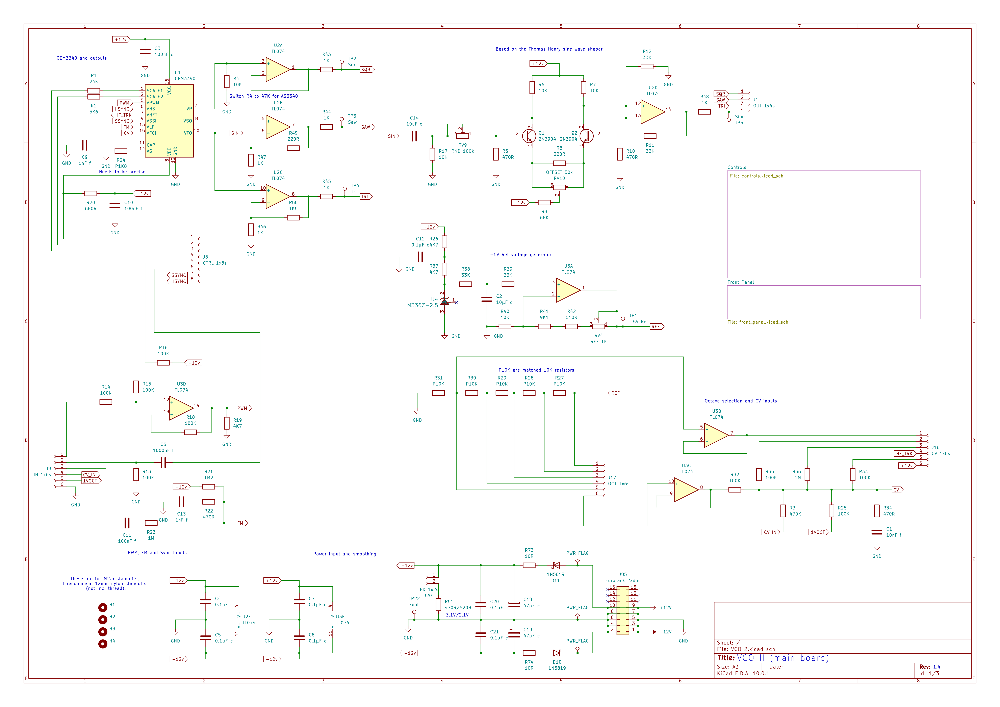
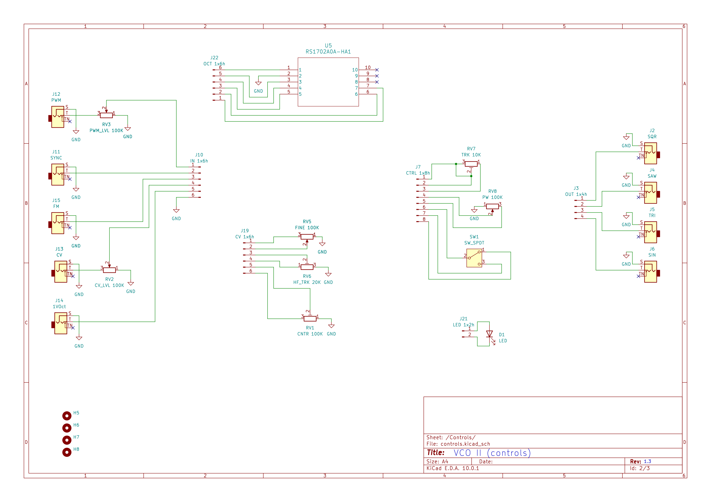

# VCO 2

This VCO based on the work of  LMNC [performance VCO](https://www.lookmumnocomputer.com/1222-performance-vco). I've swapped out the built in tuner for a sine wave generator based on the Henry Thomas design. I also expanded the octave range by one and enabled hard/soft sync selection. Finally I've set the gain on the output Op-Amps so that everything is around 9-10V out. Why drop the tuner? Well, I'm unlikely to go performing and I was thinking I'll just build a single tuning module to take advantage of the control panel trim pots.

There are a couple of folders included, these contain footprints I used for the switches, import these as project specific items. There is also a JLCPCB folder for the fabrication files of the PCB, I used [JLCPCB](https://jlcpcb.com) for producing this complex board. The PCB design is my own.

I hope you find this useful, and a huge thanks to the LMNC site for some inspiration to do this version of a VCO, also to the lovely people at OnChip Systems (nee [Curtis Electromusic](https://www.curtiselectromusic.com)) who still manufacture and supply the CEM3340. I tracked them down here in San Jose to buy from the source ;)

## Calibration

### Set the reference voltage
Using the test points on the back of the module connect a multimeter in DC mode to GND (`TP22`) and `TP1` for the 5V reference. Use the trimpot next to  `TP1` to tune the voltage to read 5V.

### Shape the sine wave
Now connect an oscilloscope to the sine wave output and use the the other two trimpots to ensure the output sine wave has a good sinusoidal shape. The upper trimpot sets the roundness of the wave and the lower trimpot sets the offset.

### Tuning the module
On the front panel are three trimpots used to keep the module in tune. For this you'll need a tuner, I just use an app called `Tuner` on my phone. Also fire up the module where you plan to use it an leave it running for about half an hour so it settles to the ambient temperature of your location (this is especially important if you just moved the synth to a new location).
1. First use the `Course` trimpot to get the octave selector covering the sort of range you want.
2. Now use the `Track` trimpot to ensure that each selection on the octave selector is one octave apart from the adjacent options.
3. Once everything is one octave appart you can use the `Course` trimpot to adjust everything to be on a specific note. You may need to iterate these steps until it is all stable.

The `HF Trk` or High Frequency Track can be used in the same way as the `Track` trimpot but is for tuning to high frequencies.
